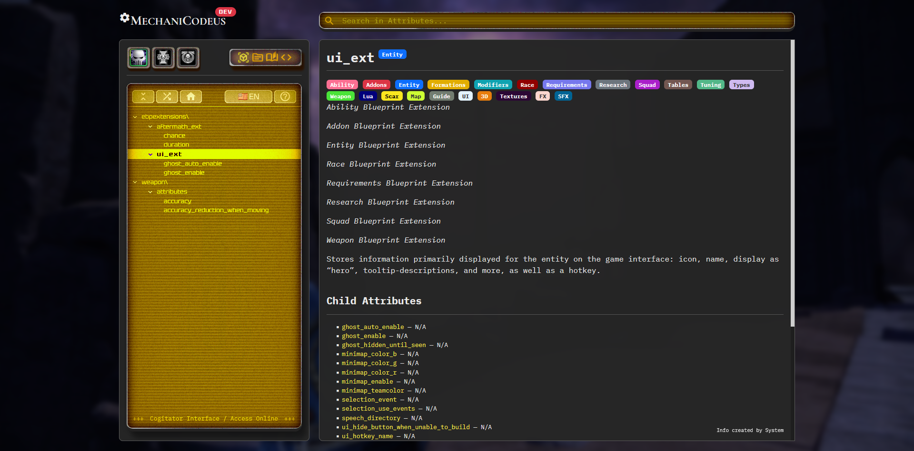
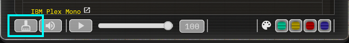
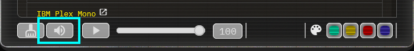
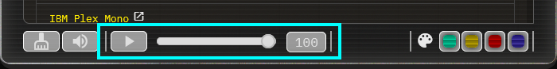
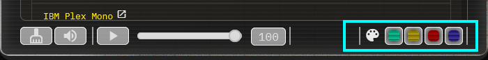

<h3 align="center">
   <a href="https://demernkardaz.github.io/MechaniCodeus/">Open the MechaniCodeus</a>
</h3>

Created with AI.

­

### EN

This is a future modding information resource for Dawn of War — Soulstorm and maybe for Dawn of War II — Retribution & Space Marine.

This will be contain the main attributes references, default structure (ingame abilities, addons, entities, squads, weapons etc.) and guides.

­

### РУ

Разрабатываемый интерфейс для нужд моддинга Dawn of War — Soulstorm, и может быть в будущем и для Dawn of War II — Retribution вместе с Space Marine.

Он будет содержать данные об основных атрибутах, стандартную структуру (существующие в игре способности, апгрейды, энтити, сквады, оружие и т.д.), а так же гайды различной направленности.

­

## Topics for you | Топики для вас

* [Common ideas topic](https://github.com/DemerNkardaz/MechaniCodeus/discussions/1)
* [Обсуждение идей](https://github.com/DemerNkardaz/MechaniCodeus/discussions/4)
* [Request to add own materials](https://github.com/DemerNkardaz/MechaniCodeus/discussions/2)
* [Реквесты для авторских материалов](https://github.com/DemerNkardaz/MechaniCodeus/discussions/3)
* [Report the Issues here | Об ошибках пишите тут](https://github.com/DemerNkardaz/MechaniCodeus/issues)

­

## Features | Возможности

#### Attribute List | Лист Атрибутов

Here placed a list with one of four content types: Attributes references, Default Structure, Guides and reserved fourth slot without appointment.

In the left-top you can selected the game, in the right-top the content type.

In-list top buttons: **Expand/Collapse list**, **Open random page**, **Open tool's homepage**, **Language select**, **About modal**.

Latest opened elements saves to cache and restores with new session.

­

Здесь размещается список одного из четырёх типов контента: Основные атрибуты, Стандартная структура, Гайды и зарезервированный четвёртый слот, не имеющий назначения.

Слева-сверху можно выбрать игру, а справа-сверху тип контента.

Верхние кнопки внутри списка: **Развернуть/Свернуть список**, **Открыть случайную страницу**, **Открыть домашнюю страницу**, **Выбрать язык**, **Модальное окно об инструменте**.

Последние открытые элементы сохраняются в кэш и восстанавливаются при новой сессии.

­

#### Search | Поиск

You can to search some stuff in Attribute List. Latest search saved to cache and restores with new session.

Вы можете совершать поиск по листу атрибутов. Последний результат поиска сохраняется в кэш и восстанавливается при новой сессии.

­

## Knowed Issues | Известные проблемы

1. Too laggy & slow loading of left-panel lists if it has much count of elements.
2. Bugging expand/collapse list.

­

## Options | Настройки

With click on the button with circled «?» in the bottom of opened modal window you can to use some options:

Внизу модального окна, всплывающего при нажатия кнопки со знаком «?», вы можете выбирать некоторые настройки:

#### Clean the Cache | Очистка кэша

Just cleans all cached interactions: latest opened page, latest opened game, latest selected options, latest search.

Просто очищает все кэшированные взаимодействия: последняя открытая страница, последняя открытая игра, последние выбранные настройки, последний поиск.

#### Enable or disable UI Sounds | Включить или отключить звуки интерфейса

#### Enable or disable ambience music and controls of it volume

Включить или отключать эмбиентную музыки и настройки её громкости

#### UI Theme | Тема интерфейса

­

## Credits

The ambient music used in MechaniCodeus are from Scott Buckley

Использованная в качестве эмбиента музыка за авторством Скотта Бакли

> 'Shadows and Dust' by Scott Buckley - released under CC-BY 4.0.
>
> 'Decoherence' by Scott Buckley - released under CC-BY 4.0.
>
> 'The Distant Sun' by Scott Buckley - released under CC-BY 4.0.
>
> 'The Encounter' by Scott Buckley - released under CC-BY 4.0.
>
> 'Ephemera' by Scott Buckley - released under CC-BY 4.0.
>
> 'Computations in a Snowstorm' by Scott Buckley - released under CC-BY 4.0.
>
> 'The Old Ones' by Scott Buckley - released under CC-BY 4.0.
>
> 'Soul Searcher' by Scott Buckley - released under CC-BY 4.0.
>
> 'Machina' by Scott Buckley - released under CC-BY 4.0.

> www.scottbuckley.com.au
